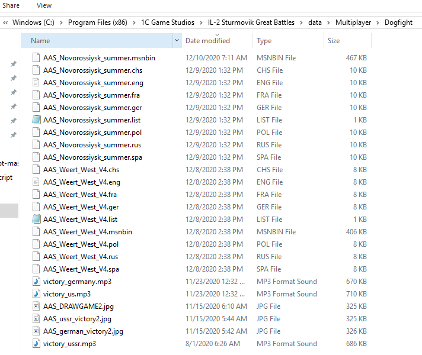
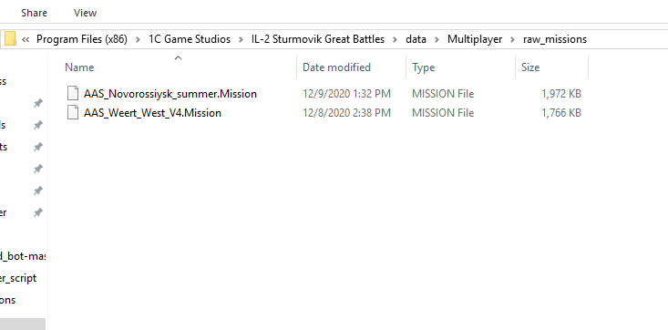

# Script to randomize the weather between two games on the same mission for multiplayer

This is a python script. It will monitor the missions launched by a Dserver and trigger a function that will change the weather options of the mission once it is ending.
This way, the next time the mission gets launched in the mission rotation, the weather will be different

## Python Installation
Install python 3. For instance, use Anaconda to install python on your server :
https://repo.anaconda.com/archive/Anaconda3-2019.10-Windows-x86_64.exe
To launch a python console: windows key + type anaconda + hit enter on  'anaconda prompt' 

## Mission files organization  
The Dogfight folder should not contain the .Mission file as it would be downloaded by players by default which is not optimal (slower download speed).
Instead the raw mission files should be in another folder. In my case:
 "C:\\Program Files (x86)\\1C Game Studios\IL-2 Sturmovik Great Battles\\data\\Multiplayer\\raw_missions"
 example with a dogfight folder with two missions: 


You can see the  .msnbin file as well as briefing files and images/audio files used in the missions.
the corresponding 'raw mission' folder:


## Configuring the script
* Change the paths to your il2 installation and to your dogfight and raw mission folder in the config_weather_script.py file
* Change the random weather presets you want the script to chpose from

## launch the script 
* In the anaconda prompt, go to the script folder (using the cd commandline)
* After your dserver is running, launch the script: 
```
python random_weather.py
```
The weather should change in between two missions

## Thanks

Thanks to Murleen for the mlg2txt parser (https://github.com/Murleen/mlg2txt)


 
